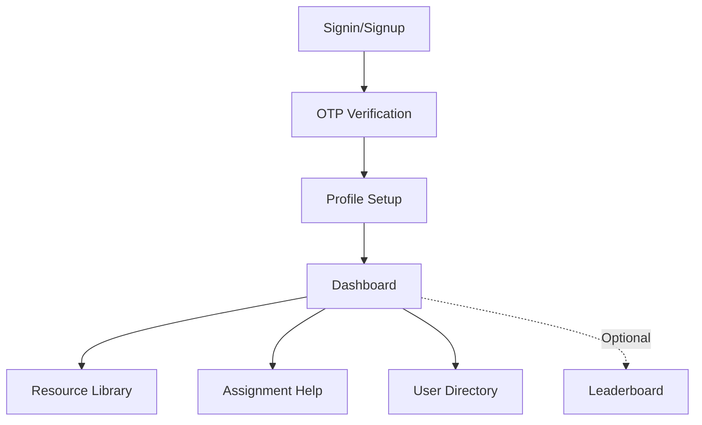

### Essential Authentication Flow (3 pages)
1. **Signup Page**  
   (Email + Full Name → triggers OTP)
2. **OTP Verification Page**  
   (Code input + resend option)
3. **Signin Page**  
   (Email-only → triggers OTP)

### Core Student Features (7 pages)
4. **Dashboard**  
   (Quick access to all features, notifications)
5. **Profile Setup Wizard**  
   (Mandatory: GitHub/LinkedIn/Portfolio links + projects with live URLs)
6. **Resource Library**  
   (Search/filter resources, upload button)
7. **Resource Upload Modal**  
   (Simple form - no separate page needed)
8. **Assignment Help Forum**  
   (Question list with filters)
9. **Question Detail Page**  
   (Answers section + post reply)
10. **User Directory**  
    (Search mentors/teammates by skills)

### Bonus (If Time Permits)
11. **Leaderboard Page**  
    (CP rankings with college filter)
12. **Basic Meeting List**  
    (Upcoming sessions with join links)

---

### Page Rationale
1. **Authentication (3 pages):**  
   - Non-negotiable foundation
   - OTP flow matches your tech stack
   
2. **Profile Setup (1 page):**  
   - Mandatory for your "portfolio URL" requirement
   - Gatekeeps other features

3. **Resource System (1 page + modal):**  
   - Library page shows value immediately
   - Upload via modal saves development time

4. **Assignment Help (2 pages):**  
   - Forum list shows activity
   - Detail page enables engagement

5. **User Directory (1 page):**  
   - Solves "finding teammates" pain point
   - Minimal viable implementation

---

### Excluded for MVP
- Clan/club management pages
- Complex meeting systems
- Separate leaderboards
- Admin interfaces
- Calendar views
- Advanced search pages

---

### Flow Diagram

This keeps you at **10 core pages** (8 essential + 2 bonus) - achievable in 12 days with your team size and tech stack. All pages directly solve the problems you highlighted: resource sharing, assignment help, and team/mentor discovery.