### **"ChaatNet" - Essential Vendor Sourcing Platform**  
*(Core: Group Buying | Unique: Voice-First Procurement)*  

---

### **Core Problem Solved**  
Street vendors waste 2+ hours/day and 15-20% costs sourcing ingredients individually from unverified suppliers.

---

### **Dual-Platform Solution**  
**1. Vendor App (Mobile-First PWA)**  
- **Group Buying Hub**:  
  - Create/join bulk orders with nearby vendors  
  - Real-time progress tracking ("5 more kg needed for wholesale price")  
- **Verified Suppliers**:  
  - Geolocated suppliers with license badges  
  - Crowd-sourced quality ratings (1-5 stars + photo proofs)  
- **Live Delivery Tracking**:  
  - Simple map view with delivery ETA  

**2. Supplier Portal (Web Dashboard)**  
- **Bid Management**:  
  - Submit competitive bids for group orders  
- **Route Optimization**:  
  - Auto-cluster deliveries by location  
- **Inventory Sync**:  
  - Quick stock level updates  

---

### **Unique Feature: Voice-First Procurement**  
**Solve for**: 68% vendors are semi-literate (NSSO data)  
- **Voice Commands**:  
  - "Order atta 10kg" → auto-creates purchase request  
  - "Find cheapest onions" → voice-read price comparisons  
- **Voice Feedback**:  
  - "Rate last delivery" → converts speech to 5-star rating  
- **Local Language Support**:  
  - Hindi/Tamil/Bengali voice processing  

---

### **Minimal Tech Stack**  
| Role | Tools | Focus |  
|------|-------|-------|  
| **Frontend** | React + Vite | creating |  
| **Designer** | Figma + css | Low-literacy interface, voice UX flows |  
| **Backend 1** | python + you can choose | Real-time group orders, user auth |  
| **Backend 2** | Python + Google Speech API | Voice command processing |  

---

### **48-Hour Build Focus**  
1. **Critical Path Features**:  
   - Vendor: Voice order → Join group buy → Track delivery  
   - Supplier: Bid on orders → Confirm delivery  
2. **Voice MVP Flow**:  
   ```mermaid  
   graph LR  
   A[Vendor: 'Order potatoes 5kg'] --> B(Speech-to-text conversion)  
   B --> C(Add to group order)  
   C --> D[Alert: 'Added! 8kg total - 2kg to wholesale price']  
   ```  
3. **Quality Assurance**:  
   - Post-delivery photo rating (vendor)  
   - Supplier rating dashboard (supplier)  

---

### **Why This Works**  
- **Core Impact**: Group buying → immediate 10-15% cost savings  
- **Unique Accessibility**: Voice-first → includes non-literate users  
- **Team Alignment**:  
  - 2 backend devs handle complex:  
    - Real-time group orders (Backend 1)  
    - Voice AI pipeline (Backend 2)  
  - Designer ensures intuitive low-literacy UI  
  - Frontend builds responsive PWA  

**Live Demo Focus**: Show voice-to-order → group discount → delivery in <3 min.

### **Streamlined Solution: "ChaatNet"**  
*(Core: Group Buying | Unique: Voice-First Procurement)*  

---

### **Core Features (Must-Have)**  
**1. Vendor PWA (Mobile-First):**  
- 📦 **Group Order Hub**  
  - Create bulk orders for specific ingredients  
  - See real-time progress ("Need 5kg more for wholesale price")  
  - Invite nearby vendors via SMS/WhatsApp  
- 📍 **Verified Supplier Network**  
  - Geolocated suppliers with license badges  
  - Crowd-sourced quality ratings (1-5 stars + photo proofs)  
- 🚚 **Live Delivery Tracking**  
  - Simple map view with driver ETA  
  - SMS alerts at key milestones  

**2. Supplier Portal (Web):**  
- 💰 **Bid on Group Orders**  
  - Submit competitive bulk pricing  
  - Auto-calculate delivery costs  
- 🗺️ **Route Optimization**  
  - Cluster deliveries by location  
  - Generate fuel-efficient routes  
- 📊 **Inventory Sync**  
  - 2-click stock updates (green/red indicators)  

---

### **Unique Feature: Voice-First Procurement**  
**Solves**: Language/illiteracy barriers (68% vendors semi-literate)  
- 🎙️ **Voice Commands**  
  - "Order atta 10kg" → auto-creates purchase request  
  - "Find cheapest onions" → voice-read price comparisons  
- 📢 **Voice Feedback**  
  - "Rate last delivery" → converts speech to 5-star rating  
- 🌐 **Local Language Support**  
  - Hindi/Tamil/Bengali voice processing  

---

### **Tech Implementation Plan**  
**Frontend (React PWA):**  
- Voice interface with Web Speech API  
- Mapbox GL for delivery tracking  
- Tailwind CSS for responsive design  

**Designer (Figma → UI):**  
- Color-coded voice interaction states  
- Icon-first navigation (no text dependency)  
- Bulk order progress visualization  

**Backend 1 (Firebase):**  
- Real-time group order management  
- Geofirestore for location-based vendor matching  
- Twilio SMS integration  

**Backend 2 (Python):**  
- Google Speech-to-Text for voice processing  
- Basic NLP for command extraction ("Order [item] [quantity]")  
- Supplier bidding algorithm  

---

### **48-Hour Build Sequence**  
**Phase 1: Foundations (12 hrs)**  
1. Designer delivers voice-UI kit + procurement workflow  
2. Backend sets up Firebase collections:  
   - `vendors` (location, inventory needs)  
   - `group_orders` (items, target quantity, expiry)  
3. Frontend scaffolds PWA with voice button  

**Phase 2: Core Flow (24 hrs)**  
1. **Vendor voice order** → Firebase request  
2. **Group order creation** → SMS invites  
3. **Supplier bidding** → auto-select best offer  
4. **Live tracking** with simulated drivers  

**Phase 3: Polish (12 hrs)**  
- Voice feedback system ("Rate delivery 4 stars")  
- Photo-based quality verification  
- Stress test with 20 mock users  

---

### **Minimal Functional Demo**  
**User Flow:**  

```mermaid
sequenceDiagram
    Vendor->>+App: "Order potatoes 5kg" (Hindi)
    App->>+Backend: Convert speech → text
    Backend->>+Firebase: Create/open group order
    Firebase->>+Vendors: SMS: "Join potato order!"
    Supplier->>App: Bid ₹100/kg (delivery included)
    App->>Vendor: "Order confirmed! ETA 11AM"
    Vendor->>App: "Rate delivery good" → 4★ + photo
```


**What Works in Demo:**  
1. Voice order → group order creation  
2. Real-time order progress tracking  
3. Supplier bidding + auto-accept  
4. Delivery tracking + voice rating  

---

### **Exclusion for Deadline**  
- Supplier route optimization (show as "coming soon")  
- Advanced price prediction (use static market data)  
- Multi-language support beyond Hindi  

---

### **Why Judges Will Love This**  
1. **Human-Centric**: Voice-first design solves real literacy barriers  
2. **Immediate Impact**: Group orders → 15% cost savings on day 1  
3. **Scalable Tech**: Built on serverless stack (Firebase)  
4. **Unique Angle**: First voice-procurement for street vendors  

**Pitch Hook**:  
*"While others build apps for literate users, we built one that listens to the 68% who've been ignored."*  

**Hosted URL**: `https://chaatnet.vercel.app` (frontend) + (backend)  

--- 

#### **Core Focus: Voice-Driven Group Buying**  
*Prioritize one flawless workflow over multiple half-built features.*  

---

### **Phase 1: Foundation (8 Hours)**  
**Designer (Hours 0-8):**  
- Create 4 critical screens:  
  1. Voice command interface (vendor)  
  2. Group order dashboard (vendor/supplier)  
  3. Live tracking view (vendor)  
  4. Rating popup (vendor)  
- Use **pre-built Tailwind components** for speed  

**Backend Team (Hours 0-8):**  
- Set up Firebase:  
  - `vendors` collection (phone, location, language)  
  - `group_orders` collection (items, targetQty, status)  
  - `suppliers` collection (licenseID, rating)  
- Implement Twilio SMS API for order invites  

**Frontend (Hours 0-8):**  
- Scaffold React PWA with:  
  - Web Speech API wrapper  
  - Mapbox GL static map placeholder  
  - Firebase auth (phone login)  

---

### **Phase 2: Core Flow (12 Hours)**  
**Voice Order → Group Buy → Tracking** *(Parallel work)*  

| Task | Owner | Time |  
|------|-------|------|  
| **Voice command processing** | Backend 2 | 4 hrs |  
| - Hindi speech-to-text (Google Speech API) |  |  |  
| - Command parser: "Order [item] [quantity]" |  |  |  
| **Group order logic** | Backend 1 | 4 hrs |  
| - Create/join orders in Firestore |  |  |  
| - Auto-calculate bulk discounts |  |  |  
| **Vendor UI implementation** | Frontend | 8 hrs |  
| - Voice interaction UI |  |  |  
| - Group order progress bar |  |  |  
| **Supplier bidding UI** | Designer → Frontend | 4 hrs |  
| - Bid submission form |  |  |  
| - Order acceptance flow |  |  |  

---

### **Phase 3: Polish & Demo Prep (6 Hours)**  
**Critical Final Touches:**  
1. **Voice Feedback System** (2 hrs)  
   - "Rate delivery good" → converts to 4★ rating (Backend 2)  
2. **Simulated Tracking** (2 hrs)  
   - Fake driver movement on Mapbox (Frontend)  
3. **Preload Demo Data** (1 hr)  
   - Seed Firestore with:  
     - 10 vendors near Mumbai Central  
     - 5 suppliers with licenses  
4. **Smoke Testing** (1 hr)  
   - Test full flow: Voice → Group Order → Delivery → Rating  

---

### **Features That Will WORK**  
1. **Vendor PWA:**  
   - Hindi voice order ("Order aata 5kg")  
   - Join/create group orders  
   - Track simulated delivery  
   - Voice-rate delivery  
2. **Supplier Portal:**  
   - View active group orders  
   - Submit bids  
   - Accept orders  

---

### **What We'll Simulate for Demo**  
- **SMS Invites**: Use Twilio sandbox (no real SMS)  
- **Delivery Tracking**: Pre-recorded driver path  
- **Supplier Bids**: Manual bid submission (no auto-match)  

---

### **Deadline-Safe Compromises**  
1. Skip multi-language support (Hindi only)  
2. Use static supplier ratings (no live updates)  
3. Simple bulk discount rule:  
   ```js  
   // Example: 10kg+ orders = 15% discount  
   if (totalQty >= 10) price *= 0.85; 
   ```  

---

### **Pitch Video Script (5 Mins)**  
**0:00-0:30** - Hook: Vendor struggling at market (stock video)  
**0:30-1:30** - Demo: Voice order → Group buy formation (show 15% savings)  
**1:30-2:30** - Supplier POV: Bid on order → Accept → Track delivery  
**2:30-3:30** - Impact: Show time/cost savings calculations  
**3:30-4:00** - Tech highlight: Voice AI workflow  
**4:00-5:00** - Scalability: "Next steps with UPI partnerships"  

---

### **Hosting & Deployment**  
- **Frontend**: Vercel (auto-deploy from Git)  
- **Backend**: Firebase (no server setup)  
- **Demo URL**: `https://chaatnet-demo.vercel.app`  

### **Last-Minute Survival Checklist**  
- [ ] Pre-record voice commands for demo stability  
- [ ] Prepare 3 test vendors/suppliers in Firestore  
- [ ] Write 1-min backup script if voice API fails  

> "Perfect the core. Ship the rest later." - 44-hour mantra

### Workflow & Architecture Diagrams for "ChaatNet"

#### 1. Vendor Workflow

```mermaid
graph TD
  A[Vendor Opens PWA] --> B[Voice Command: <br>'Order aloo 5kg'<br>Hindi Speech]
  B --> C{System}
  C --> D[Convert Speech → Text]
  D --> E[Parse Command: Item=Potato, Qty=5kg]
  E --> F{Existing Group Order?}
  F -->|Yes| G[Join Order]
  F -->|No| H[Create New Group Order]
  G --> I[Show Progress: <br>'12/20kg collected']
  H --> I
  I --> J[Auto-SMS Invites to<br>Nearby Vendors]
  J --> K[Suppliers Submit Bids]
  K --> L[Auto-Select Best Bid]
  L --> M[Delivery Tracking:<br>Live Map + ETA]
  M --> N[Voice Feedback:<br>'Rate delivery good']
  N --> O[Convert to 4★ Rating]
```


#### 2. Supplier Workflow


#### 3. System Architecture


### Key Architecture Components

1. **Voice Processing Pipeline**:

```mermaid
sequenceDiagram
  Vendor->>PWA: Hindi Voice Command
  PWA->>Web Speech API: Audio Stream
  Web Speech API->>Firebase: Raw Text
  Firebase->>Python NLP: "आलू ५ किलो ऑर्डर करो"
  Python NLP-->>Firestore: {item: "potato", qty: 5}
```


2. **Group Order Matching**:


3. **Data Structure Snippets:
```javascript
// Firestore Collections
vendors: {
  phone: "+91XXXXXX",
  location: GeoPoint,
  language: "hindi",
  active_order: "order123"
}

group_orders: {
  item: "potato",
  target_qty: 20,
  current_qty: 15,
  expiry: Timestamp,
  bids: [
    {supplier: "s123", price: 85, status: "pending"}
  ]
}
```

### Critical Integration Points
1. **Voice-to-Order**: Web Speech API → Custom NLP → Firestore
2. **Geolocation Matching**: Firebase Geoqueries → 1km radius vendors
3. **Bid Management**: Real-time Firestore listeners → Auto-bid selection
4. **Demo Safety Net**: Pre-recorded voice samples + static map paths

### Simulated Demo Flow
